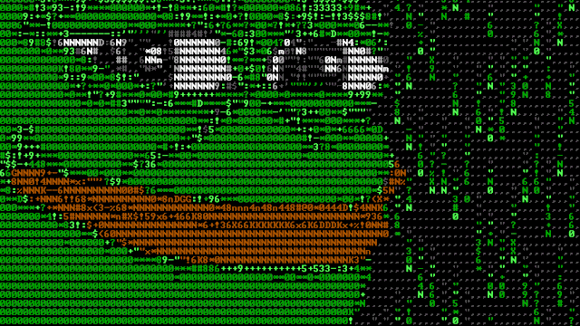
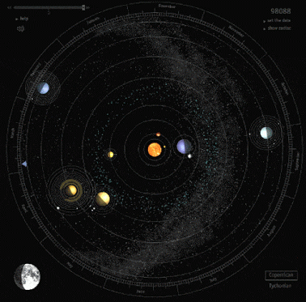

# desafio-github-markdown
Desafio projeto para certificação git|git-hub

<h1 align="center">
  
</h1>

<h3 align="center">👨‍💻 Um entusiasta de tecnologia e amante da inovação.</h3>

 

  🌱 Atualmente aprendendo: <strong>HTML, CSS, JavaScript, React</strong>  
    
  ⚡ Fatos curiosos: <strong>Amo filmes de terror, tecnologia, animes e treinar.</strong>

 

 
  
  
  

<h2 align="center">⚒️ Ferramentas de Programação ⚒️</h2>
 

  

 

  

## 🏅 Meus Certificados

  <table>
    <tr>
      <td align="center">
        
         
        <strong>Certificado Git|Git-hub</strong>
      </td>
    </tr>
  </table>

<h2 align="center">🐍 Minhas Contribuições 🐍</h2>
 

  

 

<h2 align="center">⚡ Status ⚡</h2>
 

  

<h2 align="center">🔥 Motivação diária 🔥</h2>
 

>"Não importa o caminho você deve sempre seguir em frente"
>> - Júlio Cézar

  

